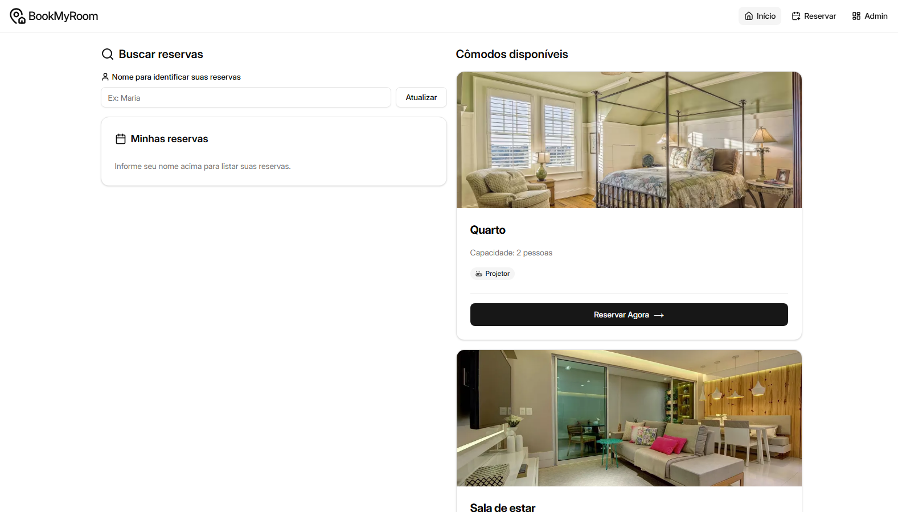

 

# 🏢 Sistema de Reserva de cômodos BookMyRoom

Sistema para reservas de cômodos por data e horário. Usuários fazem reservas e veem as próprias; administradores gerenciam cômodos, reservas e conflitos de agenda.

---

## 🎯 Objetivo do Projeto

* Consolidar conhecimentos em **React + TypeScript**
* Praticar **consumo de API REST** (estrutura pronta para integração)
* Aplicar **validação de formulários**
* Trabalhar com **datas, horários e conflitos de agenda**
* Utilizar **componentes reutilizáveis** e UI consistente (shadcn/ui + Tailwind)

---

## 🛠️ Stack

| Tecnologia      | Uso                              |
|-----------------|----------------------------------|
| React 19        | UI + hooks                       |
| TypeScript      | Tipagem estática                 |
| Vite 7          | Build e dev server               |
| React Router 7  | Rotas (/, /reservation, /admin)  |
| Tailwind CSS 4  | Estilos                          |
| shadcn/ui       | Button, Card, Badge, Input, Label|
| Lucide React    | Ícones                           |

Dados persistidos em **localStorage** (cômodos, reservas, nome do usuário). Pronto para trocar por API REST.

---

## 🚀 Como rodar

```bash
# Clone o repositório
git clone https://github.com/predo17/BookMyRoom.git

# Entre no diretório do projeto
cd bookmyroom

# Instalar dependências
npm install

# Desenvolvimento
npm run dev

```

---

## 🗂️ Estrutura do Projeto

```
src/
├── App.tsx                     # Rotas e layout
├── main.tsx                    # Entry + BookMyRoomProvider
├── index.css                   # Tailwind e temas
├── components/
│   ├── Header.tsx              # Nav: Início, Reservar, Admin
│   ├── layout/
│   │   ├── Home.tsx            # Cômodos + “Minhas reservas”
|   |   ├── Admin.tsx           # Adicionar/Remover cômodos
|   |   └── Reservation.tsx     # Código do formulário
│   ├── room/
│   │   └── RoomCard.tsx        # Card da sala + botão Reservar
│   └── ui/                     # Button, Card, Badge, Input, Label
├── context/
│   └── BookMyRoomContext.tsx   # Estado global (reservas, Cômodos, usuário)
├── data/
│   └── rooms.ts                # Cômodos iniciais
├── lib/
│   ├── conflicts.ts            # getConflicts, isSlotOccupied
│   ├── slots.ts                # getTimeSlots, isPastDate, getMinDate, formatSlotLabel
│   └── utils.ts                # cn (clsx + tailwind-merge)
├── pages/
│   ├── HomePage.tsx            # Página inicial
│   ├── ReservationPage.tsx     # Formulário de reserva
│   └── AdminPage.tsx           # Dashboard admin
└── types/
    ├── room.ts                 # Room
    └── reservation.ts          # Reservation, TimeSlot
```

---

## 🛣️ Rotas

| Rota          | Descrição                                    |
|---------------|----------------------------------------------|
| `/`           | Home: cômodos disponíveis + minhas reservas  |
| `/reservation`| Formulário de reserva (aceita `?room=id`)    |
| `/admin`      | Dashboard: reservas, conflitos, CRUD cômodos |

---

## 🧩 Funcionalidades Implementadas

### 👤 Usuário

| Funcionalidade | Onde | Detalhes |
|----------------|------|----------|
| Ver salas      | `/`  | Lista com nome, capacidade, projetor |
| Formulário     | `/reservation` | Nome, cômodo, **data** (min = hoje), **horário** (slots 8h–18h) |
| Horários       | `/reservation` | Apenas horários **livres**; ocupados desabilitados |
| Criar reserva  | `/reservation` | Validações (nome, data não passada, horário disponível) |
| Minhas reservas| `/`  | Nome em “Nome para identificar suas reservas”; lista filtrada por nome |

### 👨‍💻 Administrador

| Funcionalidade | Onde | Detalhes |
|----------------|------|----------|
| Ver reservas   | `/admin` | Tabela: cômodos, data, horário, usuário |
| Conflitos      | `/admin` | Card “Conflitos de horário” e lista de grupos (mesma cômodos+data+horário com 2+ reservas)   |
| Badge conflito | Tabela   | Reservas em conflito com badge “Conflito” |
| Cancelar       | Tabela   | Botão de lixeira com `confirm` |
| CRUD salas     | `/admin` | Nova cômodos, Editar (form no topo), Remover (confirma e remove reservas da cômodos)

### 🗂️ Regras de Negócio

* Um cômodo **não pode** ser reservado no mesmo horário por dois usuários → slots ocupados **não são exibidos como selecionáveis**.
* **Datas passadas** não podem ser selecionadas → `min` do `<input type="date">` e checagem em `isPastDate`.
* **Horários inválidos** bloqueados → somente slots retornados por `getAvailableSlots` são clicáveis.

---

## 📦 Persistência (localStorage)

| Chave                    | Conteúdo                          |
|--------------------------|-----------------------------------|
| `bookmyroom_reservations`| `Reservation[]`                   |
| `bookmyroom_rooms`       | `Room[]` (sobrescreve `data/rooms` após alteração) |
| `bookmyroom_user`        | Nome para “Minhas reservas”       |

## 📄 Licença

Projeto de estudo.
